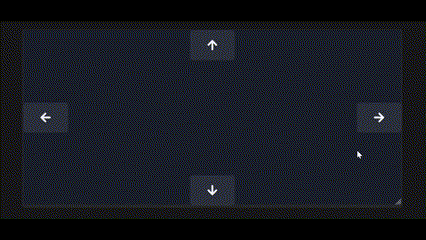

# Framer Animations

> Simple, programmatic `framer-motion` animations

## Loader/spinner

> Fully controlled loader/spinner


```jsx
import { useLoader } from 'framer-animations'

const { loader, animate } = useLoader()

async function request() {
  animate('load')
  try {
    const r = await fetch()
    // ...
    animate('succeed')
  }
  catch {
    // ...
    animate('fail')
  }
}

return (
  <div>
    // ...
    {loader}
  </div>
)
```

## Slideshow/full-page carousel

> Presence-based slideshow



```jsx
import { Slideshow } from 'framer-animations'

const [page, setPage] = useState('home')
const [dir, setDir] = useState('right')

const elem = (() => {
  switch (page) {
    case 'home':
      return (
        <div>
          // ...
          <button onClick={() => { setPage('about'); setDir('right') }}>About</button>
        </div>
      )
    case 'about':
      return (
        <div>
          // ...
          <button onClick={() => { setPage('home'); setDir('left') }}>Back</button>
        </div>
      )
    case '...':
      ...
  }
})()

return (
  <Slideshow pageKey={page} direction={dir}>
    {elem}
  </Slideshow>
)
```